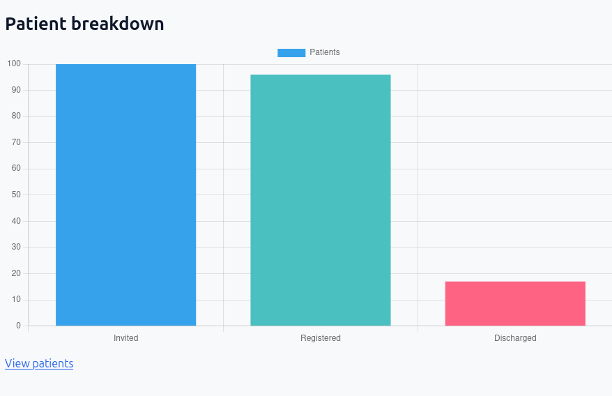
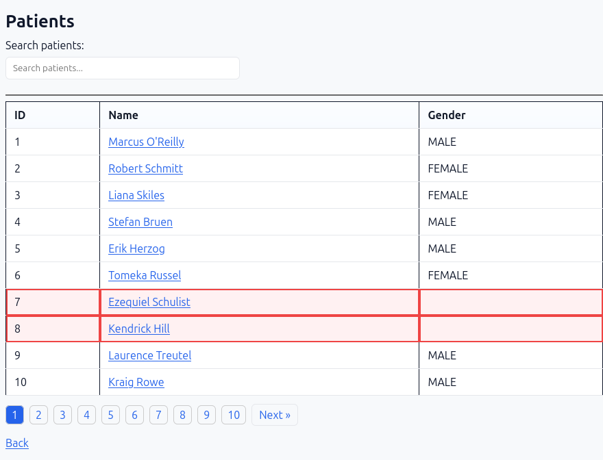
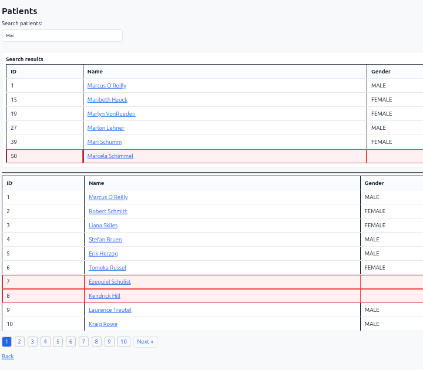
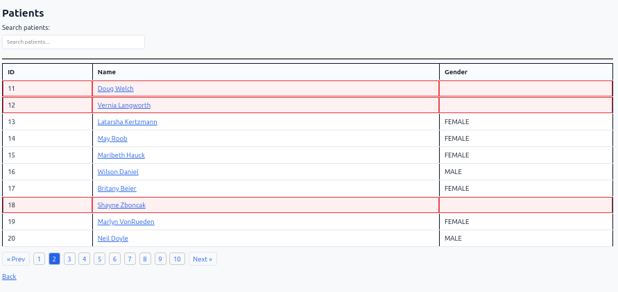
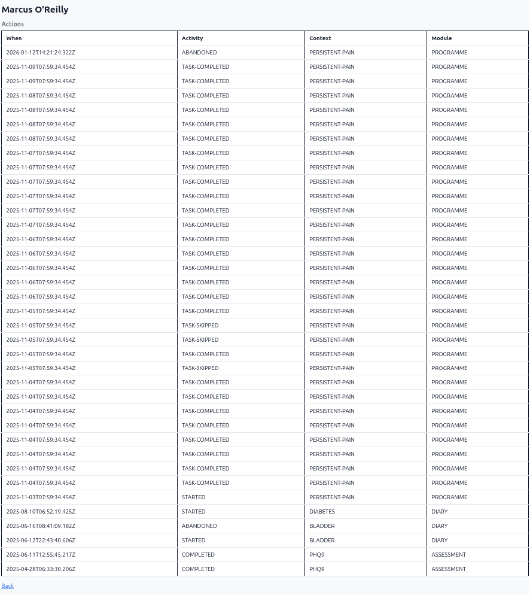

#### Development

Please read the [Development Log](DEV-LOG.md) for more detail on development steps taken.

Once you have *cloned* the repository, you must get the *.sql files for creating the database, loading the data, and configuring constraints.

**To** wipe the database.  I have had to use sudo commands to remove the data directory and stop the docker container.  
I have not been able to do this as a non-root user:

Check the docker container;  Remove the data directory; stop the container; check the container is no longer running:
```
$ docker ps
CONTAINER ID   IMAGE         COMMAND                  CREATED             STATUS             PORTS                                         NAMES
19fdee91c4fe   postgres:15   "docker-entrypoint.s…"   About an hour ago   Up About an hour   0.0.0.0:5432->5432/tcp, [::]:5432->5432/tcp   healthcare-db-1

$ sudo rm -rf data
[sudo] password for *****

$ sudo docker-compose -f docker-compose.yml down
[+] Running 2/2
 ✔ Container healthcare-db-1   Removed                                                                                                                                                                                                                                                                 0.0s 
 ✔ Network healthcare_default  Removed                                                                                                                                                                                                                                                                 0.2s 

$ docker ps
CONTAINER ID   IMAGE     COMMAND   CREATED   STATUS    PORTS     NAMES
```

**Installation**

Check the docker-compose version:
```
$ docker-compose --version
Docker Compose version v2.29.2
```
Installing PostgreSQL database and client, load data:

```
$ sudo docker-compose -f docker-compose.yml up -d db
[+] Running 2/2
 ✔ Network healthcare_default  Created                                                                                                                                                                                                                                                                 0.2s 
 ✔ Container healthcare-db-1   Started    
```
Examine the docker logs (summary) - seeing 3201 and 101 shows the data has been imported:
```
$ sudo docker-compose -f docker-compose.yml logs -f db
 
 waiting for server to start....2026-07-04 17:12:32.325 UTC [49] LOG:  starting PostgreSQL 15.18 (Debian 15.18-1.pgdg13+1) on x86_64-pc-linux-gnu, compiled by gcc (Debian 14.2.0-19) 14.2.0, 64-bit
 [snip]
  setval 
db-1  | --------
db-1  |    3201
db-1  | (1 row)
db-1  | 
db-1  |  setval 
db-1  | --------
db-1  |     101
db-1  | (1 row)

LOG:  database system is ready to accept connections

$
```


**Running** Unit and Integration Tests:
```
$ mvn test
[INFO] Scanning for projects...
[INFO] 
[INFO] ----------------------------------------------< com.chocksaway:Healthcare >-----------------------------------------------
[INFO] Building Healthcare 0.0.1-SNAPSHOT
[INFO]   from pom.xml
[INFO] ---------------------------------------------------------[ jar ]----------------------------------------------------------
[INFO] 
[INFO] --- resources:3.5.0:resources (default-resources) @ Healthcare ---
[INFO] Copying 1 resource from src/main/resources to target/classes
[INFO] Copying 4 resources from src/main/resources to target/classes
[INFO] 
[INFO] --- compiler:3.15.0:compile (default-compile) @ Healthcare ---
[INFO] Recompiling the module because of changed source code.
[INFO] Compiling 10 source files with javac [debug parameters release 21] to target/classes
[INFO] 
[INFO] --- resources:3.5.0:testResources (default-testResources) @ Healthcare ---
[INFO] skip non existing resourceDirectory /home/workspace/Healthcare/src/test/resources
[INFO] skip non existing resourceDirectory /home/workspace/Healthcare/src/test/resources-filtered
[INFO] 
[INFO] --- compiler:3.15.0:testCompile (default-testCompile) @ Healthcare ---
[INFO] Recompiling the module because of changed dependency.
[INFO] Compiling 7 source files with javac [debug parameters release 21] to target/test-classes
[INFO] 
[INFO] --- surefire:3.5.6:test (default-test) @ Healthcare ---
[INFO] Using auto detected provider org.apache.maven.surefire.junitplatform.JUnitPlatformProvider
[INFO] 
[INFO] -------------------------------------------------------
[INFO]  T E S T S
[INFO] -------------------------------------------------------
[INFO] Running com.chocksaway.healthcare.service.PatientServiceSpringTest
[INFO] [stdout] 
[INFO] [stdout]   .   ____          _            __ _ _
[INFO] [stdout]  /\\ / ___'_ __ _ _(_)_ __  __ _ \ \ \ \
[INFO] [stdout] ( ( )\___ | '_ | '_| | '_ \/ _` | \ \ \ \
[INFO] [stdout]  \\/  ___)| |_)| | | | | || (_| |  ) ) ) )
[INFO] [stdout]   '  |____| .__|_| |_|_| |_\__, | / / / /
[INFO] [stdout]  =========|_|==============|___/=/_/_/_/
[INFO] [stdout] 
[INFO] [stdout]  :: Spring Boot ::                (v4.1.0)
[INFO] [stdout] 
[INFO] [stdout] 2026-07-04T18:19:09.016+01:00  INFO 399436 --- [Healthcare] [           main] c.c.h.service.PatientServiceSpringTest   : Starting PatientServiceSpringTest using Java 21.0.3 with PID 399436 (started workspace/Healthcare)
[INFO] [stdout] 2026-07-04T18:19:09.018+01:00  INFO 399436 --- [Healthcare] [           main] c.c.h.service.PatientServiceSpringTest   : No active profile set, falling back to 1 default profile: "default"
[WARNING] [stderr] Mockito is currently self-attaching to enable the inline-mock-maker. This will no longer work in future releases of the JDK. Please add Mockito as an agent to your build as described in Mockito's documentation: https://javadoc.io/doc/org.mockito/mockito-core/latest/org.mockito/org/mockito/Mockito.html#0.3
[WARNING] [stderr] OpenJDK 64-Bit Server VM warning: Sharing is only supported for boot loader classes because bootstrap classpath has been appended
[WARNING] [stderr] WARNING: A Java agent has been loaded dynamically (/home/*****/.m2/repository/net/bytebuddy/byte-buddy-agent/1.18.10/byte-buddy-agent-1.18.10.jar)
[WARNING] [stderr] WARNING: If a serviceability tool is in use, please run with -XX:+EnableDynamicAgentLoading to hide this warning
[WARNING] [stderr] WARNING: If a serviceability tool is not in use, please run with -Djdk.instrument.traceUsage for more information
[WARNING] [stderr] WARNING: Dynamic loading of agents will be disallowed by default in a future release
[INFO] [stdout] 2026-07-04T18:19:10.129+01:00  INFO 399436 --- [Healthcare] [           main] c.c.h.service.PatientServiceSpringTest   : Started PatientServiceSpringTest in 1.29 seconds (process running for 1.903)
[INFO] Tests run: 3, Failures: 0, Errors: 0, Skipped: 0, Time elapsed: 1.619 s -- in com.chocksaway.healthcare.service.PatientServiceSpringTest
[INFO] Running com.chocksaway.healthcare.service.PatientServiceTest
[INFO] Tests run: 7, Failures: 0, Errors: 0, Skipped: 0, Time elapsed: 0.148 s -- in com.chocksaway.healthcare.service.PatientServiceTest
[INFO] Running com.chocksaway.healthcare.db.data.integrity.AfterDataLoadedSequenceTest
[INFO] [stdout] 
[INFO] [stdout]   .   ____          _            __ _ _
[INFO] [stdout]  /\\ / ___'_ __ _ _(_)_ __  __ _ \ \ \ \
[INFO] [stdout] ( ( )\___ | '_ | '_| | '_ \/ _` | \ \ \ \
[INFO] [stdout]  \\/  ___)| |_)| | | | | || (_| |  ) ) ) )
[INFO] [stdout]   '  |____| .__|_| |_|_| |_\__, | / / / /
[INFO] [stdout]  =========|_|==============|___/=/_/_/_/
[INFO] [stdout] 
[INFO] [stdout]  :: Spring Boot ::                (v4.1.0)
[INFO] [stdout] 
[INFO] [stdout] 2026-07-04T18:19:10.511+01:00  INFO 399436 --- [Healthcare] [           main] c.c.h.d.d.i.AfterDataLoadedSequenceTest  : Starting AfterDataLoadedSequenceTest using Java 21.0.3 with PID 399436 (started by ***** in /home/*****/workspace/Healthcare)
[INFO] [stdout] 2026-07-04T18:19:10.511+01:00  INFO 399436 --- [Healthcare] [           main] c.c.h.d.d.i.AfterDataLoadedSequenceTest  : No active profile set, falling back to 1 default profile: "default"
[INFO] [stdout] 2026-07-04T18:19:10.880+01:00  INFO 399436 --- [Healthcare] [           main] .s.d.r.c.RepositoryConfigurationDelegate : Bootstrapping Spring Data JPA repositories in DEFAULT mode.
[INFO] [stdout] 2026-07-04T18:19:10.907+01:00  INFO 399436 --- [Healthcare] [           main] .s.d.r.c.RepositoryConfigurationDelegate : Finished Spring Data repository scanning in 22 ms. Found 2 JPA repository interfaces.
[INFO] [stdout] 2026-07-04T18:19:11.175+01:00  INFO 399436 --- [Healthcare] [           main] org.hibernate.orm.jpa                    : HHH008540: Processing PersistenceUnitInfo [name: default]
[INFO] [stdout] 2026-07-04T18:19:11.229+01:00  INFO 399436 --- [Healthcare] [           main] org.hibernate.orm.core                   : HHH000001: Hibernate ORM core version 7.4.1.Final
[INFO] [stdout] 2026-07-04T18:19:11.404+01:00  INFO 399436 --- [Healthcare] [           main] o.s.o.j.p.SpringPersistenceUnitInfo      : No LoadTimeWeaver setup: ignoring JPA class transformer
[INFO] [stdout] 2026-07-04T18:19:11.424+01:00  INFO 399436 --- [Healthcare] [           main] com.zaxxer.hikari.HikariDataSource       : HikariPool-1 - Starting...
[INFO] [stdout] 2026-07-04T18:19:11.553+01:00  INFO 399436 --- [Healthcare] [           main] com.zaxxer.hikari.pool.HikariPool        : HikariPool-1 - Added connection org.postgresql.jdbc.PgConnection@45430a27
[INFO] [stdout] 2026-07-04T18:19:11.555+01:00  INFO 399436 --- [Healthcare] [           main] com.zaxxer.hikari.HikariDataSource       : HikariPool-1 - Start completed.
[INFO] [stdout] 2026-07-04T18:19:11.602+01:00  INFO 399436 --- [Healthcare] [           main] org.hibernate.orm.connections.pooling    : HHH10001005: Database info:
[INFO] [stdout]         Database JDBC URL [jdbc:postgresql://localhost:5432/mydb]
[INFO] [stdout]         Database driver: PostgreSQL JDBC Driver
[INFO] [stdout]         Database dialect: PostgreSQLDialect
[INFO] [stdout]         Database version: 15.18
[INFO] [stdout]         Default catalog/schema: mydb/public
[INFO] [stdout]         Autocommit mode: undefined/unknown
[INFO] [stdout]         Isolation level: READ_COMMITTED [default READ_COMMITTED]
[INFO] [stdout]         JDBC fetch size: none
[INFO] [stdout]         Pool: DataSourceConnectionProvider
[INFO] [stdout]         Minimum pool size: undefined/unknown
[INFO] [stdout]         Maximum pool size: undefined/unknown
[INFO] [stdout] 2026-07-04T18:19:12.121+01:00  INFO 399436 --- [Healthcare] [           main] org.hibernate.orm.core                   : HHH000489: No JTA platform available (set 'hibernate.transaction.jta.platform' to enable JTA platform integration)
[INFO] [stdout] 2026-07-04T18:19:12.151+01:00 DEBUG 399436 --- [Healthcare] [           main] org.hibernate.SQL                        : create sequence action_entity_id_seq start with 1 increment by 1
[INFO] [stdout] Hibernate: create sequence action_entity_id_seq start with 1 increment by 1
[INFO] [stdout] 2026-07-04T18:19:12.158+01:00 DEBUG 399436 --- [Healthcare] [           main] org.hibernate.SQL                        : create sequence patient_entity_id_seq start with 1 increment by 1
[INFO] [stdout] Hibernate: create sequence patient_entity_id_seq start with 1 increment by 1
[INFO] [stdout] 2026-07-04T18:19:12.172+01:00  INFO 399436 --- [Healthcare] [           main] j.LocalContainerEntityManagerFactoryBean : Initialized JPA EntityManagerFactory for persistence unit 'default'
[INFO] [stdout] 2026-07-04T18:19:12.213+01:00  INFO 399436 --- [Healthcare] [           main] o.s.d.j.r.query.QueryEnhancerFactories   : Hibernate is in classpath; If applicable, HQL parser will be used.
[INFO] [stdout] 2026-07-04T18:19:12.856+01:00  WARN 399436 --- [Healthcare] [           main] JpaBaseConfiguration$JpaWebConfiguration : spring.jpa.open-in-view is enabled by default. Therefore, database queries may be performed during view rendering. Explicitly configure spring.jpa.open-in-view to disable this warning
[INFO] [stdout] 2026-07-04T18:19:12.867+01:00  INFO 399436 --- [Healthcare] [           main] o.s.b.w.a.WelcomePageHandlerMapping      : Adding welcome page template: index
[INFO] [stdout] 2026-07-04T18:19:13.153+01:00  INFO 399436 --- [Healthcare] [           main] c.c.h.d.d.i.AfterDataLoadedSequenceTest  : Started AfterDataLoadedSequenceTest in 2.698 seconds (process running for 4.926)
[INFO] Tests run: 1, Failures: 0, Errors: 0, Skipped: 0, Time elapsed: 2.775 s -- in com.chocksaway.healthcare.db.data.integrity.AfterDataLoadedSequenceTest
[INFO] Running com.chocksaway.healthcare.db.data.integrity.ActionPatientJoinTest
[INFO] [stdout] 2026-07-04T18:19:13.188+01:00  INFO 399436 --- [Healthcare] [           main] t.c.s.AnnotationConfigContextLoaderUtils : Could not detect default configuration classes for test class [com.chocksaway.healthcare.db.data.integrity.ActionPatientJoinTest]: ActionPatientJoinTest does not declare any static, non-private, non-final, nested classes annotated with @Configuration.
[INFO] [stdout] 2026-07-04T18:19:13.197+01:00  INFO 399436 --- [Healthcare] [           main] .b.t.c.SpringBootTestContextBootstrapper : Found @SpringBootConfiguration com.chocksaway.healthcare.HealthcareApplication for test class com.chocksaway.healthcare.db.data.integrity.ActionPatientJoinTest
[INFO] [stdout] 2026-07-04T18:19:13.199+01:00  INFO 399436 --- [Healthcare] [           main] t.c.s.AnnotationConfigContextLoaderUtils : Could not detect default configuration classes for test class [com.chocksaway.healthcare.db.data.integrity.ActionPatientJoinTest]: ActionPatientJoinTest does not declare any static, non-private, non-final, nested classes annotated with @Configuration.
[INFO] [stdout] 2026-07-04T18:19:13.200+01:00  INFO 399436 --- [Healthcare] [           main] .b.t.c.SpringBootTestContextBootstrapper : Found @SpringBootConfiguration com.chocksaway.healthcare.HealthcareApplication for test class com.chocksaway.healthcare.db.data.integrity.ActionPatientJoinTest
[INFO] [stdout] 2026-07-04T18:19:13.318+01:00 DEBUG 399436 --- [Healthcare] [           main] org.hibernate.SQL                        : select coalesce(max(p1_0.entity_id),0) from patient p1_0
[INFO] [stdout] Hibernate: select coalesce(max(p1_0.entity_id),0) from patient p1_0
[INFO] [stdout] 2026-07-04T18:19:13.339+01:00 DEBUG 399436 --- [Healthcare] [           main] org.hibernate.SQL                        : SELECT setval('patient_entity_id_seq', ?)
[INFO] [stdout] Hibernate: SELECT setval('patient_entity_id_seq', ?)
[INFO] [stdout] 2026-07-04T18:19:13.344+01:00 DEBUG 399436 --- [Healthcare] [           main] org.hibernate.SQL                        : select coalesce(max(a1_0.entity_id),0) from action a1_0
[INFO] [stdout] Hibernate: select coalesce(max(a1_0.entity_id),0) from action a1_0
[INFO] [stdout] 2026-07-04T18:19:13.345+01:00 DEBUG 399436 --- [Healthcare] [           main] org.hibernate.SQL                        : SELECT setval('action_entity_id_seq', ?)
[INFO] [stdout] Hibernate: SELECT setval('action_entity_id_seq', ?)
[INFO] [stdout] 2026-07-04T18:19:13.349+01:00 DEBUG 399436 --- [Healthcare] [           main] org.hibernate.SQL                        : select nextval('patient_entity_id_seq')
[INFO] [stdout] Hibernate: select nextval('patient_entity_id_seq')
[INFO] [stdout] 2026-07-04T18:19:13.363+01:00 DEBUG 399436 --- [Healthcare] [           main] org.hibernate.SQL                        : select nextval('action_entity_id_seq')
[INFO] [stdout] Hibernate: select nextval('action_entity_id_seq')
[INFO] [stdout] 2026-07-04T18:19:13.364+01:00 DEBUG 399436 --- [Healthcare] [           main] org.hibernate.SQL                        : select nextval('action_entity_id_seq')
[INFO] [stdout] Hibernate: select nextval('action_entity_id_seq')
[INFO] [stdout] 2026-07-04T18:19:13.372+01:00 DEBUG 399436 --- [Healthcare] [           main] org.hibernate.SQL                        : insert into patient (date_of_birth,entity_created,entity_updated,entity_version,family_name,gender,given_name,hospital_id,id,nhs_number,title,when_discharged,when_invited,when_registered,entity_id) values (?,?,?,?,?,?,?,?,?,?,?,?,?,?,?)
[INFO] [stdout] Hibernate: insert into patient (date_of_birth,entity_created,entity_updated,entity_version,family_name,gender,given_name,hospital_id,id,nhs_number,title,when_discharged,when_invited,when_registered,entity_id) values (?,?,?,?,?,?,?,?,?,?,?,?,?,?,?)
[INFO] [stdout] 2026-07-04T18:19:13.376+01:00 DEBUG 399436 --- [Healthcare] [           main] org.hibernate.SQL                        : insert into action (activity,context,entity_created,entity_updated,entity_version,id,module_id,patient_entity_id,when_recorded,entity_id) values (?,?,?,?,?,?,?,?,?,?)
[INFO] [stdout] Hibernate: insert into action (activity,context,entity_created,entity_updated,entity_version,id,module_id,patient_entity_id,when_recorded,entity_id) values (?,?,?,?,?,?,?,?,?,?)
[INFO] [stdout] 2026-07-04T18:19:13.377+01:00 DEBUG 399436 --- [Healthcare] [           main] org.hibernate.SQL                        : insert into action (activity,context,entity_created,entity_updated,entity_version,id,module_id,patient_entity_id,when_recorded,entity_id) values (?,?,?,?,?,?,?,?,?,?)
[INFO] [stdout] Hibernate: insert into action (activity,context,entity_created,entity_updated,entity_version,id,module_id,patient_entity_id,when_recorded,entity_id) values (?,?,?,?,?,?,?,?,?,?)
[INFO] [stdout] 2026-07-04T18:19:13.396+01:00 DEBUG 399436 --- [Healthcare] [           main] org.hibernate.SQL                        : select a1_0.entity_id,a1_0.activity,a1_0.context,a1_0.entity_created,a1_0.entity_updated,a1_0.entity_version,a1_0.id,a1_0.module_id,a1_0.patient_entity_id,a1_0.when_recorded from action a1_0 join patient p1_0 on p1_0.entity_id=a1_0.patient_entity_id where p1_0.entity_id=? order by a1_0.when_recorded desc
[INFO] [stdout] Hibernate: select a1_0.entity_id,a1_0.activity,a1_0.context,a1_0.entity_created,a1_0.entity_updated,a1_0.entity_version,a1_0.id,a1_0.module_id,a1_0.patient_entity_id,a1_0.when_recorded from action a1_0 join patient p1_0 on p1_0.entity_id=a1_0.patient_entity_id where p1_0.entity_id=? order by a1_0.when_recorded desc
[INFO] Tests run: 1, Failures: 0, Errors: 0, Skipped: 0, Time elapsed: 0.226 s -- in com.chocksaway.healthcare.db.data.integrity.ActionPatientJoinTest
[INFO] Running com.chocksaway.healthcare.dto.ActionDTOTest
[INFO] Tests run: 2, Failures: 0, Errors: 0, Skipped: 0, Time elapsed: 0.007 s -- in com.chocksaway.healthcare.dto.ActionDTOTest
[INFO] Running com.chocksaway.healthcare.dto.PatientDTOTest
[INFO] Tests run: 2, Failures: 0, Errors: 0, Skipped: 0, Time elapsed: 0.004 s -- in com.chocksaway.healthcare.dto.PatientDTOTest
[INFO] 
[INFO] Results:
[INFO] 
[INFO] Tests run: 16, Failures: 0, Errors: 0, Skipped: 0
[INFO] 
[INFO] --------------------------------------------------------------------------------------------------------------------------
[INFO] BUILD SUCCESS
[INFO] --------------------------------------------------------------------------------------------------------------------------
[INFO] Total time:  7.266 s
[INFO] Finished at: 2026-07-04T18:19:13+01:00
[INFO] --------------------------------------------------------------------------------------------------------------------------
```

**Run** the Thymeleaf Playwright test (re-runs the previous tests):
```
$ mvn -Pplaywright verify

[INFO] Tests run: 1, Failures: 0, Errors: 0, Skipped: 0, Time elapsed: 6.057 s -- in com.chocksaway.healthcare.web.ThymeleafPlaywrightIT
[INFO] 
[INFO] Results:
[INFO] 
[INFO] Tests run: 1, Failures: 0, Errors: 0, Skipped: 0
[INFO] 
[INFO] 
[INFO] --- failsafe:3.1.2:verify (default) @ Healthcare ---
[INFO] Copying com.chocksaway:Healthcare:pom:0.0.1-SNAPSHOT to project local repository
[INFO] Copying com.chocksaway:Healthcare:jar:0.0.1-SNAPSHOT to project local repository
[INFO] --------------------------------------------------------------------------------------------------------------------------
[INFO] BUILD SUCCESS
[INFO] --------------------------------------------------------------------------------------------------------------------------
[INFO] Total time:  13.090 s
[INFO] Finished at: 2026-07-04T18:22:46+01:00
[INFO] --------------------------------------------------------------------------------------------------------------------------
$ 

```

**Building** the JAR file:
```
$ mvn clean package
[INFO] Scanning for projects...
[INFO] 
[INFO] ----------------------------------------------< com.chocksaway:Healthcare >-----------------------------------------------
[INFO] Building Healthcare 0.0.1-SNAPSHOT
[INFO]   from pom.xml
[INFO] ---------------------------------------------------------[ jar ]----------------------------------------------------------
```
**Confirming** the JAR is built:
```
/target$ ls -la

-rw-rw-r--  1 ******* ******** 60218428 Feb  1  1980 Healthcare-0.0.1-SNAPSHOT.jar
```

**Running** the application
```
Healthcare/target$ java -jar Healthcare-0.0.1-SNAPSHOT.jar 

  .   ____          _            __ _ _
 /\\ / ___'_ __ _ _(_)_ __  __ _ \ \ \ \
( ( )\___ | '_ | '_| | '_ \/ _` | \ \ \ \
 \\/  ___)| |_)| | | | | || (_| |  ) ) ) )
  '  |____| .__|_| |_|_| |_\__, | / / / /
 =========|_|==============|___/=/_/_/_/

 :: Spring Boot ::                (v4.1.0)

2026-07-04T18:29:29.642+01:00  INFO 402762 --- [Healthcare] [           main] c.c.healthcare.HealthcareApplication     : Starting HealthcareApplication v0.0.1-SNAPSHOT using Java 21.0.3 with PID 402762 (/home/******/workspace/Healthcare/target/Healthcare-0.0.1-SNAPSHOT.jar started by ****** in /home/*******/workspace/Healthcare/target)
2026-07-04T18:29:29.645+01:00  INFO 402762 --- [Healthcare] [           main] c.c.healthcare.HealthcareApplication     : No active profile set, falling back to 1 default profile: "default"
2026-07-04T18:29:30.082+01:00  INFO 402762 --- [Healthcare] [           main] .s.d.r.c.RepositoryConfigurationDelegate : Bootstrapping Spring Data JPA repositories in DEFAULT mode.
2026-07-04T18:29:30.124+01:00  INFO 402762 --- [Healthcare] [           main] .s.d.r.c.RepositoryConfigurationDelegate : Finished Spring Data repository scanning in 31 ms. Found 2 JPA repository interfaces.
2026-07-04T18:29:30.495+01:00  INFO 402762 --- [Healthcare] [           main] o.s.boot.tomcat.TomcatWebServer          : Tomcat initialized with port 8080 (http)
2026-07-04T18:29:30.514+01:00  INFO 402762 --- [Healthcare] [           main] o.apache.catalina.core.StandardService   : Starting service [Tomcat]
2026-07-04T18:29:30.514+01:00  INFO 402762 --- [Healthcare] [           main] o.apache.catalina.core.StandardEngine    : Starting Servlet engine: [Apache Tomcat/11.0.22]
2026-07-04T18:29:30.544+01:00  INFO 402762 --- [Healthcare] [           main] b.w.c.s.WebApplicationContextInitializer : Root WebApplicationContext: initialization completed in 859 ms
2026-07-04T18:29:30.685+01:00  INFO 402762 --- [Healthcare] [           main] org.hibernate.orm.jpa                    : HHH008540: Processing PersistenceUnitInfo [name: default]
2026-07-04T18:29:30.722+01:00  INFO 402762 --- [Healthcare] [           main] org.hibernate.orm.core                   : HHH000001: Hibernate ORM core version 7.4.1.Final
2026-07-04T18:29:30.974+01:00  INFO 402762 --- [Healthcare] [           main] o.s.o.j.p.SpringPersistenceUnitInfo      : No LoadTimeWeaver setup: ignoring JPA class transformer
2026-07-04T18:29:31.001+01:00  INFO 402762 --- [Healthcare] [           main] com.zaxxer.hikari.HikariDataSource       : HikariPool-1 - Starting...
2026-07-04T18:29:31.190+01:00  INFO 402762 --- [Healthcare] [           main] com.zaxxer.hikari.pool.HikariPool        : HikariPool-1 - Added connection org.postgresql.jdbc.PgConnection@71a2df1
2026-07-04T18:29:31.191+01:00  INFO 402762 --- [Healthcare] [           main] com.zaxxer.hikari.HikariDataSource       : HikariPool-1 - Start completed.
2026-07-04T18:29:31.244+01:00  INFO 402762 --- [Healthcare] [           main] org.hibernate.orm.connections.pooling    : HHH10001005: Database info:
        Database JDBC URL [jdbc:postgresql://localhost:5432/mydb]
        Database driver: PostgreSQL JDBC Driver
        Database dialect: PostgreSQLDialect
        Database version: 15.18
        Default catalog/schema: mydb/public
        Autocommit mode: undefined/unknown
        Isolation level: READ_COMMITTED [default READ_COMMITTED]
        JDBC fetch size: none
        Pool: DataSourceConnectionProvider
        Minimum pool size: undefined/unknown
        Maximum pool size: undefined/unknown
2026-07-04T18:29:31.813+01:00  INFO 402762 --- [Healthcare] [           main] org.hibernate.orm.core                   : HHH000489: No JTA platform available (set 'hibernate.transaction.jta.platform' to enable JTA platform integration)
2026-07-04T18:29:31.856+01:00  INFO 402762 --- [Healthcare] [           main] j.LocalContainerEntityManagerFactoryBean : Initialized JPA EntityManagerFactory for persistence unit 'default'
2026-07-04T18:29:31.910+01:00  INFO 402762 --- [Healthcare] [           main] o.s.d.j.r.query.QueryEnhancerFactories   : Hibernate is in classpath; If applicable, HQL parser will be used.
2026-07-04T18:29:32.696+01:00  WARN 402762 --- [Healthcare] [           main] JpaBaseConfiguration$JpaWebConfiguration : spring.jpa.open-in-view is enabled by default. Therefore, database queries may be performed during view rendering. Explicitly configure spring.jpa.open-in-view to disable this warning
2026-07-04T18:29:32.711+01:00  INFO 402762 --- [Healthcare] [           main] o.s.b.w.a.WelcomePageHandlerMapping      : Adding welcome page template: index
2026-07-04T18:29:32.946+01:00  INFO 402762 --- [Healthcare] [           main] o.s.boot.tomcat.TomcatWebServer          : Tomcat started on port 8080 (http) with context path '/'
2026-07-04T18:29:32.951+01:00  INFO 402762 --- [Healthcare] [           main] c.c.healthcare.HealthcareApplication     : Started HealthcareApplication in 3.621 seconds (process running for 3.963)
```

Manual testing of the application can be done by opening a browser and navigating to `http://localhost:8080/`

**Patient** figures breakdown graph:



**List** of patients - page one - ten to a page (red highlighting):




**Search** for *Mar* - page one is still displayed:



**List** of patients - page two - ten to a page:



Click Marcus O'Reilly (on page one) and view Actions:



#end


